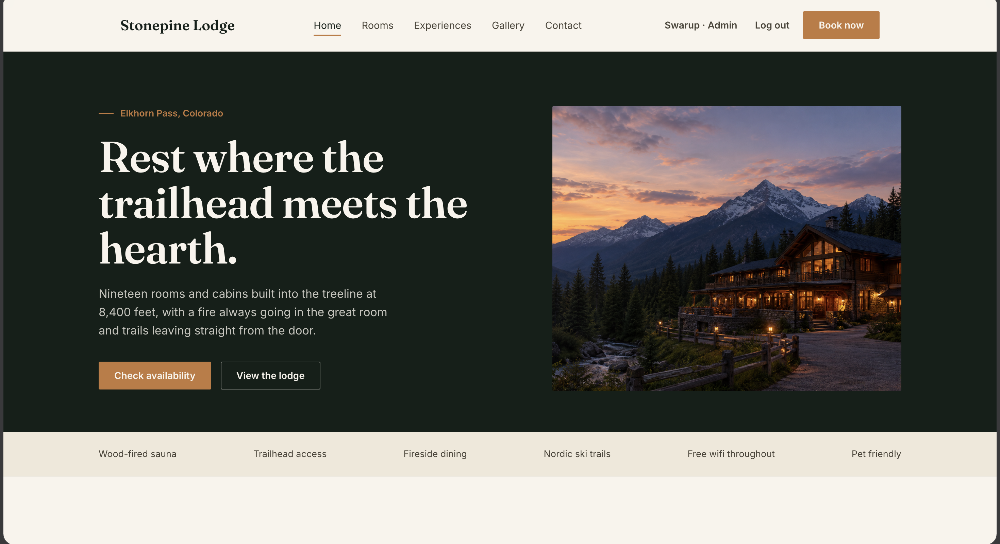
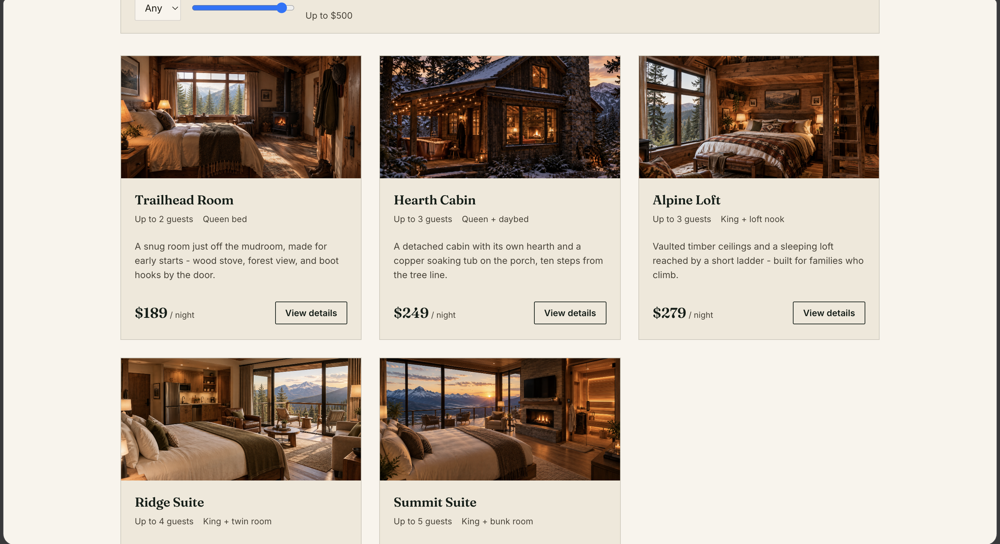
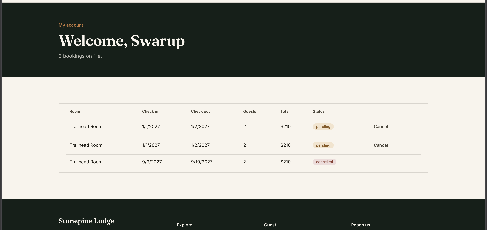
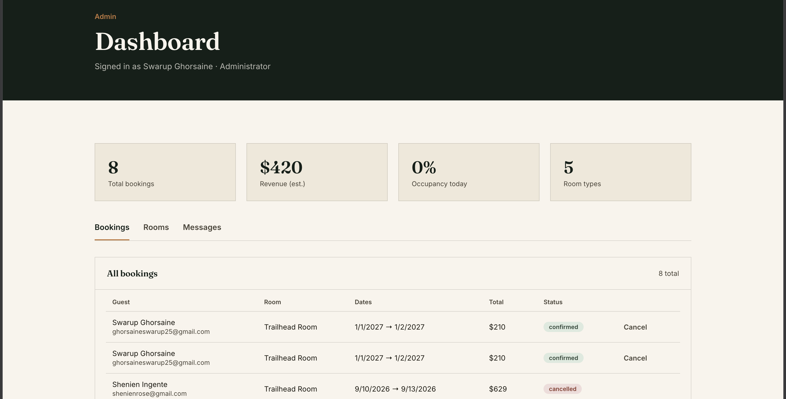

# Stonepine Lodge

A hotel booking site I built to go one step further than my last project (a restaurant reservation site). This one has real user accounts, actual availability logic, and an admin dashboard behind it — not just a form that saves to a database.

**Live:** https://stonepinelodge.vercel.app

## What it does

You can browse rooms, check if a room is actually free for your dates, book it, and see your bookings under your account. If you're an admin, you also get a dashboard to confirm/cancel bookings, add or edit rooms, and read whatever comes in through the contact form.

The interesting part isn't the pages — it's what's underneath them:
- Availability is checked by counting how many bookings overlap your requested dates and comparing that against how many physical rooms of that type exist. A room only shows "fully booked" once every unit is actually taken.
- Prices are calculated server-side at booking time, never trusted from the browser.
- Passwords are hashed with bcrypt, sessions run on JWTs, and routes are actually protected — not just hidden behind a UI check.

## Stack

Node + Express + MongoDB on the backend, plain HTML/CSS/JS on the frontend — no framework, no build step. Deployed on Vercel, connected to GitHub so pushes to main go live automatically.

The backend has one quirk worth knowing: server.js runs it locally, api/index.js runs it on Vercel as a serverless function, and both of them just import the same app.js. That way there's only one copy of the routes to keep in sync, whether you're testing on your laptop or it's live.

## Folder layout

stonepine-lodge/
├── api/index.js       — Vercel entrypoint
├── server.js           — local dev entrypoint
├── app.js                — the actual Express app, shared by both
├── config/db.js           — Mongo connection
├── models/                 — User, Room, Booking, Message
├── middleware/auth.js        — JWT auth + admin check
├── routes/                    — auth, rooms, bookings, messages, admin
├── utils/availability.js       — the date-overlap logic
├── seed/seed.js                 — seeds 5 starter rooms
└── public/                       — everything the browser loads

## Running it yourself

npm install
cp .env.example .env   (then fill in your own values)
npm run seed
npm run dev

You'll need:
- A MongoDB Atlas connection string
- A random string for JWT_SECRET (I generated mine with: node -e "console.log(require('crypto').randomBytes(32).toString('hex'))")
- Your own email in ADMIN_EMAILS — whichever email you register with there becomes the admin account, everyone else is a normal guest

Then it's running at localhost:4000.

## API, if you're poking around

POST   /api/auth/register              — Sign up
POST   /api/auth/login                 — Log in, get a token back
GET    /api/rooms                      — List rooms, filterable by guests/price
GET    /api/rooms/:slug                — One room's detail
GET    /api/rooms/:id/availability     — Check if it's free for a date range
POST   /api/bookings                   — Book a room (needs login)
GET    /api/bookings/my                — Your own bookings
PATCH  /api/bookings/:id/cancel        — Cancel one of yours
GET    /api/bookings                   — Every booking (admin)
PATCH  /api/bookings/:id/status        — Confirm/cancel any booking (admin)
POST   /api/messages                   — Contact form
GET    /api/admin/stats                — Dashboard numbers

Admin also gets full CRUD on /api/rooms (create/edit/deactivate).

## Screenshots

## Deploying

It's already hooked up to Vercel via GitHub, so pushing to main redeploys automatically. If you fork this, remember the env vars have to be added separately in Vercel's dashboard — your local .env file never travels with the code, on purpose.